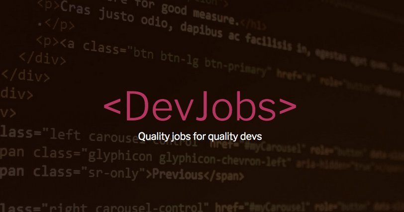

# Devjobs

## Description

Devjobs LLC is looking for a full-stack developer to build a prototype application for a job board for posting job ads  looking top notch local developers. They want to build the application in Node.js, and use a Postgres database as a persistence layer. They also want their application to expose the company and jobs database data through an API, they want to implement user authentication and permissions for posting data, and they want a React front-end for uploading form data.

## Objectives

#### Node Web Server Basics

- Use npm as a package manager to download and import packages
- Set up a web server in node
- Set up routers + routes in node.
- Use a view engine to serve `.ejs` views to users.

#### Node Data Access + APIs

- Implement the model-view-controller pattern in a node web application.
- Configure access to a postgres database (using [knex.js](https://knexjs.org/))
- Configure models for querying the database tables (using [objection.js](https://vincit.github.io/objection.js/))
- Create seed data to populate a database.
- Utilize a request client (like Postman) to configure that routes + api is working as expected

##### Node Authentication

- Utilize an authentication module in node.js
- Create a table for users in your database
- Utilize authentication methods:

  - registering users
  - logging in users
  - logging out users
  - checking for user sessions

##### React Integration

- Integrate React components into your fullstack application.
- Create components that allow a user to fetch, render, and post data through your back-end api

## Objectives

#### Node Web Server Basics

- Use npm as a package manager to download and import packages
- Set up a web server in node
- Set up routers + routes in node.
- Use a view engine to serve `.ejs` views to users.

#### Node Data Access + APIs

- Implement the model-view-controller pattern in a node web application.
- Configure access to a postgres database (using [knex.js](https://knexjs.org/))
- Configure models for querying the database tables (using [objection.js](https://vincit.github.io/objection.js/))
- Create seed data to populate a database.
- Utilize a request client (like Postman) to configure that routes + api is working as expected

##### Node Authentication

- Utilize an authentication module in node.js
- Create a table for users in your database
- Utilize authentication methods:

  - registering users
  - logging in users
  - logging out users
  - checking for user sessions

##### React Integration

- Integrate React components into your fullstack application.
- Create components that allow a user to fetch, render, and post data through your back-end api

## Assignment Structure

The assignment is separated into a series of assignments. **You will have only one repository and you will need to create a github branch for each assignment**.

1. [Node Express Server](https://github.com/muktek/assignment--fullstack-js-01-node-express-server)
2. [Server Routers](https://github.com/muktek/assignment--fullstack-js-02-server-router)
3. [Views + Static Files](https://github.com/muktek/assignment--fullstack-js-03-views-and-static-files)
4. [Data Access](https://github.com/muktek/assignment--fullstack-js-04-data-access)
5. [Models](https://github.com/muktek/assignment--fullstack-js-05-models-relations)
6. [Rest APIs](https://github.com/muktek/assignment--fullstack-js-06-rest-api)
7. [Authentication](https://github.com/muktek/assignment--fullstack-js-07-authentication)
8. [React Integration](https://github.com/muktek/assignment--fullstack-js-08-react-integration)
9. [API Integration](https://github.com/muktek/assignment--fullstack-js-09-api-integration)
